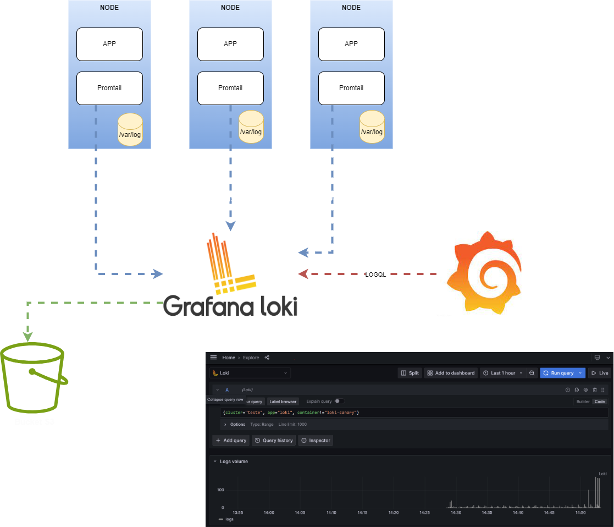

# Treinamento sobre Logs utilizando Grafana Promtail + Loki

## Arquitetura

Figure 1: Architecture

## Pre Requisitos
    **Kind**: v0.20.0
    **Docker**: 24.0.5
    **helm**: v3.13.0
    **kubectl**: 1.27.2

## Create cluster k8s
    kind create cluster --config kind/config.yaml 

## Install Grafana
    kubectl create namespace grafana
    helm repo add grafana https://grafana.github.io/helm-charts 
    helm repo update
    helm install grafana grafana/grafana --values ./grafana/values.yaml --namespace grafana --version 6.60.4
## Install Loki
    kubectl create namespace loki
    helm install loki grafana/loki --values ./loki/values.yaml --namespace loki --version 5.30.0
## Install Promtail
    kubectl create namespace promtail
    helm install promtail grafana/promtail --values ./promtail/values.yaml --namespace promtail --version 6.15.2
## Install log-generator
    cd app
    docker build  -t henriquepiccolo/log-generator:v1 .
    kind load docker-image henriquepiccolo/log-generator:v1 -n observability
    kubectl create namespace log-generator
    kubectl apply -f deployment.yaml -n log-generator

## Acesso ao Grafana
    kubectl --namespace grafana port-forward svc/grafana 3000:80

## Links
    Loki Documentation: https://grafana.com/docs/loki/latest/
    Grafana Documentation: https://grafana.com/docs/grafana/latest/
    Promtail Documentation: https://grafana.com/docs/loki/latest/send-data/promtail/
    Kind Documentation: https://kind.sigs.k8s.io/docs/user/quick-start/
    Helm Documentation: https://helm.sh/docs/
    Logql Documentation: https://grafana.com/docs/loki/latest/query/